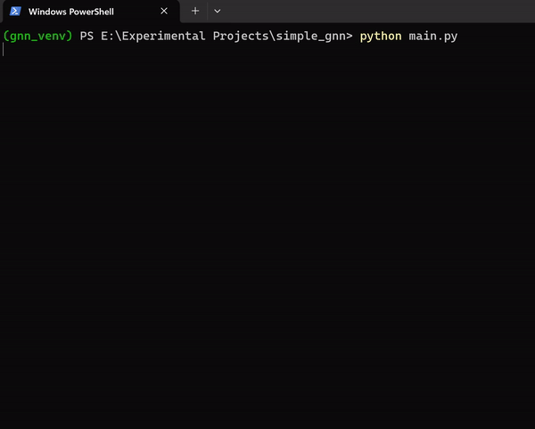

# A Simple Graph Neural Network (simple_gnn) Implementation



### If you are not a techie and have 7 min, you can read the article on this project [here](https://medium.com/@abin_varghese/dive-into-graph-neural-networks-with-pytorch-a-simple-guide-49c425faf909).

This repository contains a PyTorch implementation of a Graph Neural Network (GNN) for node classification tasks on graph-structured data. The implementation is based on the PyTorch Geometric library and follows a modular design, separating the code into different modules for better organization and maintainability.

## Project Structure

The project is structured as follows:

```
simple_gnn/
├── gnn/
│ ├── init.py
│ ├── model.py
│ ├── data.py
│ ├── train.py
│ └── evaluate.py
├── main.py
└── LICENSE
└── README.md
└── requirements.txt
```

## Overview

Graph Neural Networks (GNNs) are a powerful class of neural networks designed to operate on graph-structured data. They are inspired by Convolutional Neural Networks (CNNs) but operate on graphs instead of grid-like structures like images. The key idea is to learn representations of nodes by iteratively aggregating and updating information from their neighbors.

In this implementation, we use the message passing framework, a common paradigm for GNNs, which involves the following steps for each node:

1. **Aggregate information from neighbors**: Collect the feature vectors of neighboring nodes and edges.
2. **Update node representation**: Use a neural network to update the node's representation based on the aggregated neighborhood information.

This process is repeated for a specified number of iterations, allowing nodes to integrate information from further reaches of the graph.

## Model Architecture

The GNN model implemented in this repository consists of the following layers:

1. **Graph Convolutional Layer (GCNConv)**: This layer performs the message passing operation, aggregating information from neighboring nodes and updating the node representations.
2. **ReLU Activation**: A non-linear activation function (ReLU) is applied to the output of the GCNConv layer.
3. **Linear Layer**: A fully-connected linear layer is used to map the updated node representations to the desired output dimensions (e.g., number of classes for node classification).

## Usage:
Run the following commands on `Windows`:

```
git clone https://github.com/Spartan-119/simple_gnn.git
cd simple_gnn
python -m venv gnn_venv
gnn_venv\Scripts\activate
pip install -r requirements.txt
python main.py
```

Run the following commands on `MacOS/Linux`:
```
git clone https://github.com/Spartan-119/simple_gnn.git
cd simple_gnn
python3 -m venv gnn_venv
source gnn_venv/bin/activate
pip install -r requirements.txt
python3 main.py
```

This will load the Cora citation network dataset, train the GNN model, and evaluate its performance on the test set.

## Customization

You can customize the GNN model architecture, dataset, and hyperparameters by modifying the respective files:

- `models.py`: Modify the `GNN` class to change the model architecture.
- `data.py`: Update the `load_data` function to load a different dataset or preprocess the data differently.
- `main.py`: Adjust the hyperparameters (e.g., learning rate, hidden dimensions) when instantiating the model, optimizer, and loss function.

## Contributing

Contributions to this project are welcome! If you find any issues or have suggestions for improvements, please open an issue or submit a pull request.

## License

This project is licensed under the MIT License.
